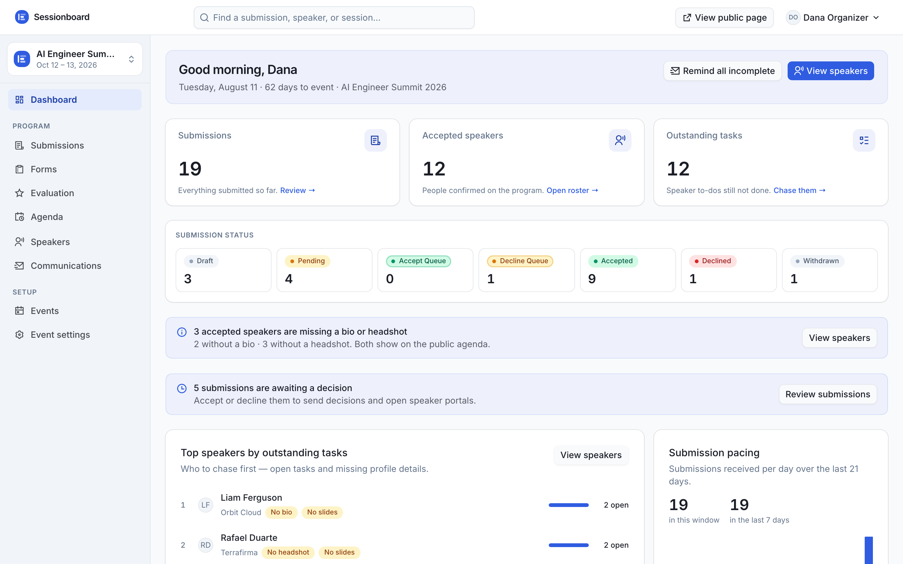
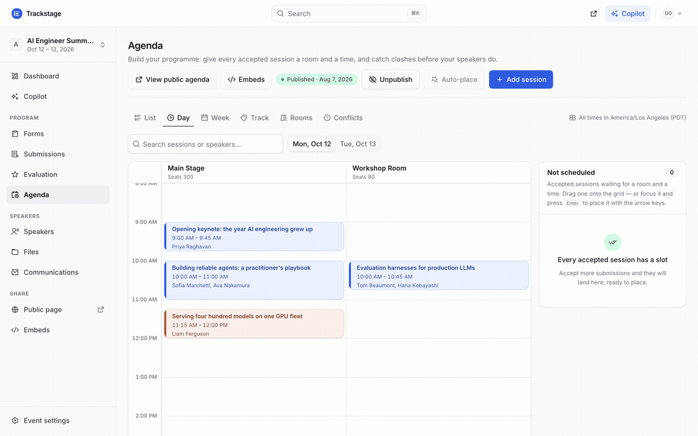
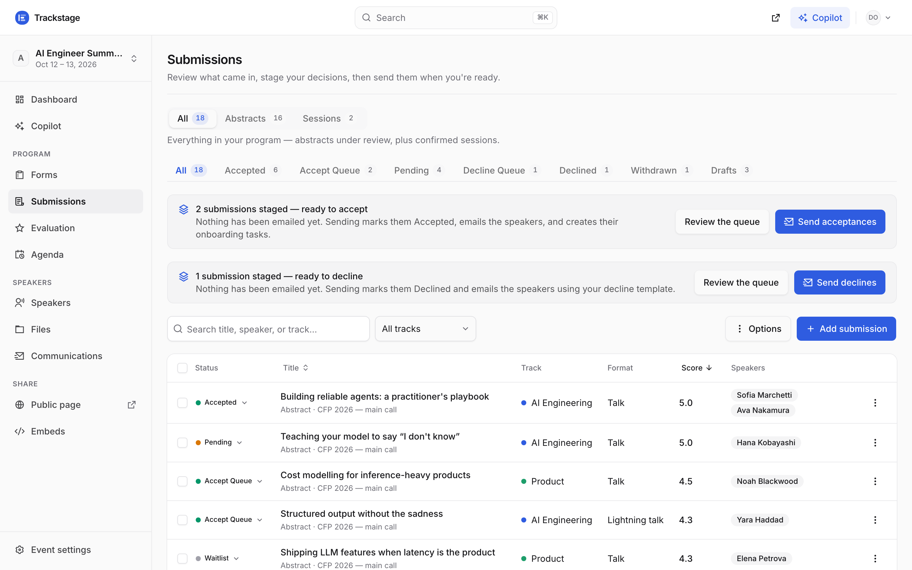
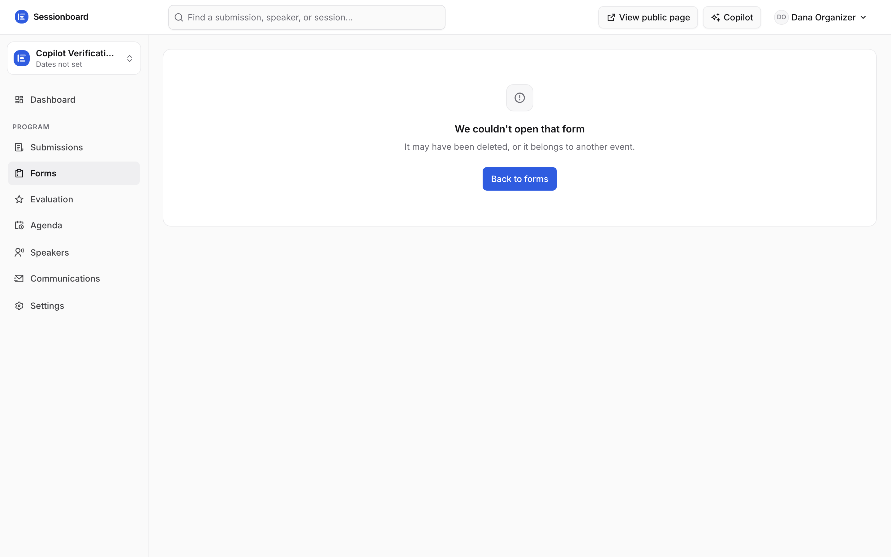
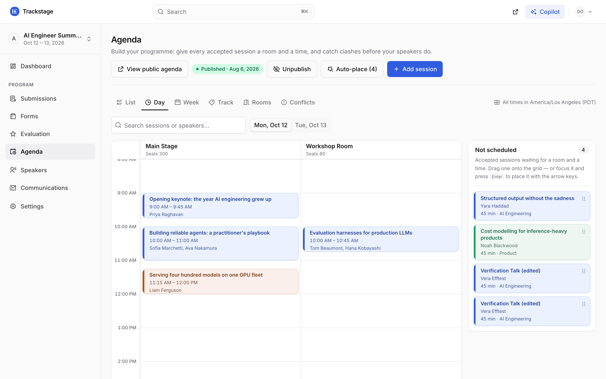
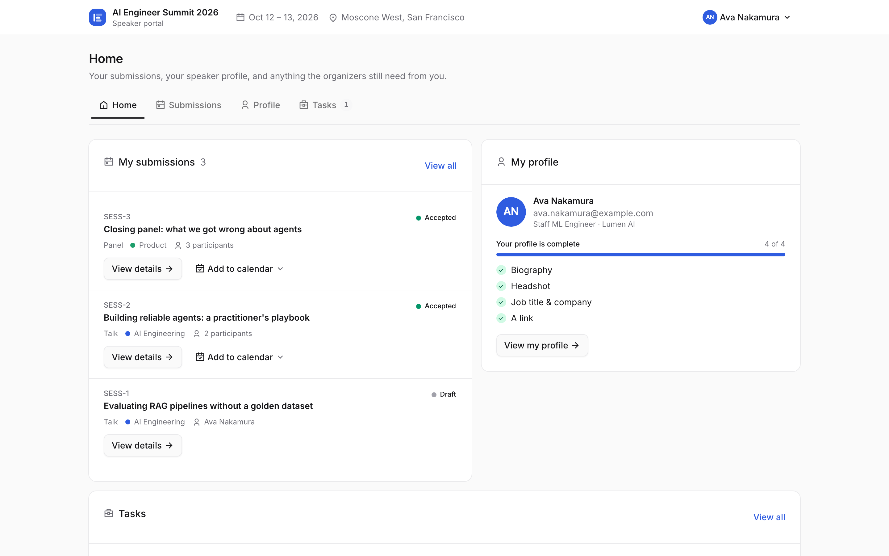

<p align="center">
  
</p>

<h1 align="center">Trackstage</h1>

<p align="center">
  Open-source speaker &amp; program management for conferences.<br/>
  Call for speakers → review → speaker portal → agenda → published program. One fast tool.
</p>

<p align="center">
  <a href="https://trackstage.app">trackstage.app</a> ·
  <a href="https://trackstage.app/launch.mp4">90-second film</a> ·
  <a href="#try-it">Try it</a> ·
  <a href="#self-host">Self-host</a> ·
  <a href="#api">API</a> ·
  <a href="#mcp">MCP</a> ·
  <a href="#ai-copilot">AI copilot</a>
</p>



## Why

Event teams pay $40k+/yr for closed speaker-management software they can't customize.
Trackstage is the open alternative: the same job — collecting talk submissions,
reviewing them, chasing speakers, building the schedule — without the enterprise sales
call. Built for non-technical event producers: plain-English screens, safe defaults,
and everything updates live.

## Try it

| I want to… | Go to |
| --- | --- |
| Run an event (organizer demo) | [trackstage.app/login](https://trackstage.app/login) — `organizer@demo.sessionboard.dev` / `demo2026` (also shown on the page) |
| Submit a talk (public CFP) | [trackstage.app/submit/ai-engineer/ai-summit-2026/cfp](https://trackstage.app/submit/ai-engineer/ai-summit-2026/cfp) |
| See what speakers see | [trackstage.app/portal](https://trackstage.app/portal) — open a speaker's emailed link (copy one from the organizer's Speakers table); no password |
| Browse a published program | [trackstage.app/e/ai-engineer/ai-summit-2026](https://trackstage.app/e/ai-engineer/ai-summit-2026) |
| Read the docs | [trackstage.app/docs](https://trackstage.app/docs) |
| Watch the launch film | [trackstage.app/launch.mp4](https://trackstage.app/launch.mp4) (90 s) |

## What's inside

**Call for speakers** — a form builder with conditional questions and track routing.
Speakers submit through a five-step public flow; drafts, per-person limits, and
deadlines are actually enforced.

**Review & decisions** — triage submissions across status tabs, stage accept/decline
queues, then commit once: emails go out, onboarding tasks appear in each speaker's
portal, and statuses flip everywhere instantly.

**Speaker portal** — passwordless. Speakers edit their talk, complete their profile,
upload headshots and slides (versioned, previewable in place, with organizer
approval), and tick off tasks.

**Agenda builder** — drag talks onto a day × room grid with live conflict detection
(room clashes *and* double-booked speakers), auto-placement, and an explicit publish
step for the public schedule.



**Communications** — templated emails with placeholders, reminder sweeps, and `.ics`
calendar invites (room details included once assigned). Real sending via Resend;
seeded demo recipients render as inspectable previews instead.

**Multi-tenant workspaces** — organizations own events; members carry roles
(owner / admin / member) with invites by email. Authentication via
[Better Auth](https://better-auth.com); authorization enforced in every function.

**Airtable sync** — one-click connect: submissions, speakers, and sessions mirror into
your base as rows (idempotent upserts), so your existing Airtable automations fire on
every new submission.

<details>
<summary><b>More screenshots</b></summary>

| | |
| --- | --- |
|  |  |
|  |  |

</details>

## Where it beats the original

Measured against Sessionboard's own product, not just matched to it:

1. **Live conflict detection.** Drag a talk onto the agenda and room clashes *and*
   double-booked speakers flag in red the moment they exist — Sessionboard makes you
   refresh to find out.
2. **Status-change emails from the pipeline itself.** Committing an accept/decline
   queue sends the decision email, creates the speaker's onboarding tasks, and flips
   every surface at once — one action, no separate mail-merge step.
3. **A REST API that actually writes.** Tracks, rooms, tags, formats, levels,
   languages and custom statuses are all creatable over the API, and webhooks are
   API-managed with HMAC signatures, one-time secrets, rotation, and a delivery log —
   Sessionboard's API reads but barely writes.
4. **An MCP server and an in-app copilot.** Operate the whole event from Claude,
   ChatGPT, or Codex — or press ⌘I and hand the work to the built-in copilot with
   approval gates. Sessionboard has nothing in this category.
5. **Speed, and you can read the code.** Every interaction is optimistic and instant —
   the complaint that started this project was sluggishness — and the entire product
   is MIT-licensed source you can self-host in five commands.

## AI copilot

Press <kbd>⌘I</kbd> anywhere in the app. The copilot talks to Trackstage through its own
MCP server — ask anything ("who hasn't finished onboarding?") or hand it work ("create a
CFP form", "schedule the unscheduled talks"). Destructive actions always stop at an
approval card first, and results render as real product UI, not prose.

## MCP

A full [MCP](https://modelcontextprotocol.io) server ships with the product — operate
your entire event from Claude, ChatGPT, Codex, or any MCP client. 84 tools in 12
groups (workspaces & events · CFP forms · submissions & decisions · agenda ·
speakers · speaker tasks · files & review · email · evaluation · event setup ·
webhooks & embeds · activity) — the always-current list renders at `/docs/mcp`.
Every tool that writes anything refuses without `confirm: true`, so the destructive
half (`delete_event`, `delete_form`, `remove_task`) is gated rather than absent —
and `delete_event` additionally demands the event's exact name.

```sh
claude mcp add trackstage --transport http https://<your-convex-site>/mcp \
  --header "Authorization: Bearer <key from Settings → API & MCP>"
```

**Claude / ChatGPT connectors** need no key at all: add the `/mcp` URL as a custom
connector and sign in — it's a real OAuth 2.1 authorization server (dynamic client
registration + PKCE). An API key is an *identity*, not a capability: every tool call
runs the same workspace-membership checks as the web app, keys are stored as hashes,
shown once, and revoke instantly. Per-client setup snippets (Codex TOML, generic JSON)
live in **Settings → API & MCP** and `/docs/mcp`.

## API

REST, Bearer-authenticated, paginated like you'd expect:

```sh
curl -H "Authorization: Bearer demo-api-token" \
  https://<your-convex-site>/v1/event/ai-summit-2026/sessions
```

`/v1/event/{slug}/sessions · /speakers · /submissions · /forms · /tasks ·
/evaluations`, workspace-level `/v1/events` and `/v1/webhooks`, plus an open
`/v1/event/{slug}/schedule.ics` calendar feed that needs no credential.
OpenAPI spec + interactive reference at `/docs/api`.

## Self-host

```sh
git clone https://github.com/markokraemer/trackstage && cd trackstage
pnpm install
pnpm dev:setup                    # provisions a free Convex backend (interactive login)
pnpm dev                          # http://localhost:3000
pnpm exec convex run seed:setup   # demo data + organizer account
```

### Deploy

```sh
pnpm deploy   # convex deploy (backend) → vite build → wrangler deploy (Worker) → smoke test
```

The build reads `.env.production` (committed, public values only), so a production
build always points at the production Convex deployment. Secrets live where they
belong and are never in the repo:

| Where | What |
| --- | --- |
| `convex env set … --prod` | `BETTER_AUTH_SECRET` · `RESEND_API_KEY` · `EMAIL_FROM` · `SITE_URL` (your app origin — required for MCP OAuth and every emailed link) · `PUBLIC_API_TOKEN` · `EXTRA_TRUSTED_ORIGINS` (optional) · `REQUIRE_EMAIL_VERIFICATION` (optional, default off) |
| `wrangler secret put …` | `OPENROUTER_API_KEY` (the copilot runs in the Worker) |

Signup always sends a confirmation email, but by default verification is
**soft**: unverified accounts work fully and just see a dismissible
"confirm your email" banner. `convex env set REQUIRE_EMAIL_VERIFICATION true`
flips on the hard gate (sign-in refused until the emailed link is opened, with
a resend screen) — no code change needed. It is deliberately OFF for the
competition: the judge's browser agent signs up with inboxes nobody can open.

`main` is the dev branch (`master` mirrors it during the transition); `prod` is
the release branch. Every push runs the full **CI** gate — typecheck · lint ·
OpenAPI spec up to date · unit tests, then the **complete Playwright e2e flows
suite** against a hermetic local Convex backend booted inside the runner. A
green run on `main`/`master` auto-deploys staging:
**https://dev.trackstage.app** (Worker `trackstage-dev`, built against the dev
Convex deployment). Releasing to production is one deliberate step:

```sh
git push origin main:prod   # promote main to production
```

A push to `prod` re-runs the same full CI gate (e2e included) and, once green,
**Deploy** ships it (Convex → build → Worker → production smoke test) — nothing
reaches production without the whole suite passing. The Actions tab's "Deploy →
Run workflow" button releases any ref manually and is the escape hatch if the
e2e gate ever wrongly blocks an urgent release. See
`.github/workflows/`. Deploys need three repo secrets: `CONVEX_DEPLOY_KEY`
(`pnpm exec convex deployment token create github-actions --prod`),
`CLOUDFLARE_API_TOKEN` (scoped: Workers Scripts R/W, Workers KV R/W, Workers
Observability Write, Account Settings Read, Workers Routes Write + Zone DNS Write)
and `CLOUDFLARE_ACCOUNT_ID`; optional `OPENROUTER_API_KEY` keeps the staging
copilot (and the copilot e2e spec) live.

Verify a deploy at any time:

```sh
node scripts/smoke-production.mjs          # 9 SSR routes + /v1 + /mcp + OAuth discovery
APP_URL=https://your-app.workers.dev node scripts/smoke-production.mjs
```

### Custom domain

Two idempotent scripts, in this order — re-run either one safely:

```sh
export CLOUDFLARE_EMAIL=… CLOUDFLARE_GLOBAL_API_KEY=…    # CF credentials
node scripts/configure-domain.mjs  yourdomain.com        # Resend domain + SPF/DKIM/MX
RESEND_API_KEY=… node scripts/attach-domain.mjs yourdomain.com trackstage
```

(`attach-domain.mjs` also accepts a scoped `CLOUDFLARE_API_TOKEN` instead — Workers
Scripts Write + Zone DNS/Routes Write — which is what CI uses. `configure-domain.mjs`
needs the global key, because it writes DNS through the account-key endpoint.)

`attach-domain.mjs` attaches the domain to the Worker, waits for it to serve, moves
Convex `SITE_URL` (Better Auth base URL, portal links, MCP OAuth issuer) onto it, and
moves `EMAIL_FROM` once Resend reports the domain verified. Then set
`VITE_SITE_URL` in `.env.production`, add the `routes`/`custom_domain` entry to
`wrangler.jsonc`, and redeploy so the client bundle agrees.

## Stack & testing

TanStack Start (React 19) · [Convex](https://convex.dev) (reactive database, file
storage, crons) · Better Auth · shadcn/ui on Base UI · Cloudflare Workers.

```sh
pnpm test          # unit (vitest)
pnpm test:backend  # 600+ live end-to-end checks across 36 sections — seeds a real
                   # Convex deployment, then drives auth, scoping, rules, files,
                   # comms, the REST API and MCP against it
pnpm test:e2e      # Playwright: route crawler + per-flow suites
```

## About

Built for [swyx's "$10,000 Kill My SaaS"](https://luma.com/ls-06v7): clone an
enterprise speaker-management SaaS in a weekend, open source, judged by the team that
would actually use it. MIT licensed. The design system lives at `/design-system` —
right-click the logo, anywhere.
